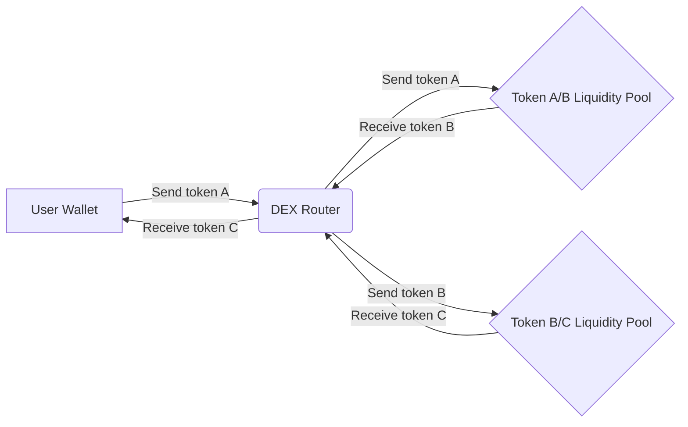
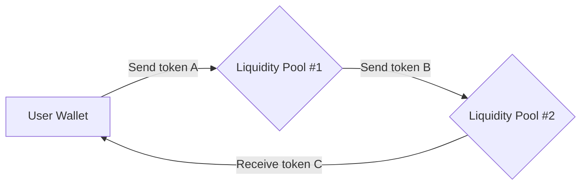

The Conveyor aggregator is currently compatible with all DEXs that conform to the Uniswap v2/v3 standard. This encompasses nearly every major DEX launched in the last few years, including Sushiswap, PancakeSwap, Camelot, Trader Joe, and several others. We plan to support several other DeFi protocols in the future including Curve, Balancer, Aave, etc.

## Why Use Conveyor's Aggregator?

Other DEX's and aggregators utilize a specific smart contract called a *Router* that communicates between various liquidity pools for both single and multi LP interactions. While this does improve the likelyhood that a transaction will be successful, all of this processing is executed on-chain with multiple external contract calls and transfers in order to work.

With Conveyor, we construct all transaction calldata off-chain in a much more effective and cost-efficient manner, and pass the most favorable swap data back to the frontend for the trader to sign with their connected wallet.

This reduces unnecessary external calls or token transfers, which reduces the amount of on-chain processing needed to perform the swap, resulting in a much more gas efficient swap.

All calldata is send and received from our API, which syncs with all v2/v3 based pool for each chain Conveyor is deployed to.

!!! Example: A trader wants to swap *X* amount of *Token A* for *Token C*
!!!
### 
How other DEX's/Aggregators handle transactions

### 
How Conveyor handles transactions

All of the calldata that the API returns to the frontend is easily verified before the transaction is signed so that the system is inherently trustless.

## Contract Approval

When performing any swap through any router, Contract approval is required in order for the swap to be successful. Conveyor has **Swap Executor** and **Swap Aggregator** contracts for each chain its deployed to.

### Swap Executor
This contract retrieves the tokens from your wallet and initiates the direct-LP swap via a *transferFrom* call. It also accepts all the calldata that you sign with your wallet, and includes the data for token contract addresses, quantities, liquidity pools, *amountOutMin*'s, and other necessary calldata in order for the swap to be successful.

### Swap Aggregator
To allow a smart contract to transfer the tokens for a swap, a trader needs to grant the smart contract permission to spend their tokens. This permission is given through the "approve" function, which is part of the ERC-20 standard for tokens.

When a user approves a smart contract, they specify the amount of tokens that the smart contract is allowed to spend. This creates an "allowance" for the smart contract, which is stored on the blockchain.

When the user initiates a DEX swap, the smart contract checks the user's allowance to ensure that it has permission to spend the necessary amount of tokens. If the allowance is sufficient, the smart contract transfers the tokens from the user's account to the smart contract's account. The smart contract then performs the swap and sends the swapped tokens to the user's account.

It's worth noting that the user can revoke the smart contract's permission to spend their tokens at any time by calling the "approve" function again with an allowance of zero. This effectively removes the smart contract's ability to spend the user's tokens.

This approval is required when transacting tokens for the first time, or when the amount you want to swap exceedes the approval amounts currently stored on-chain.