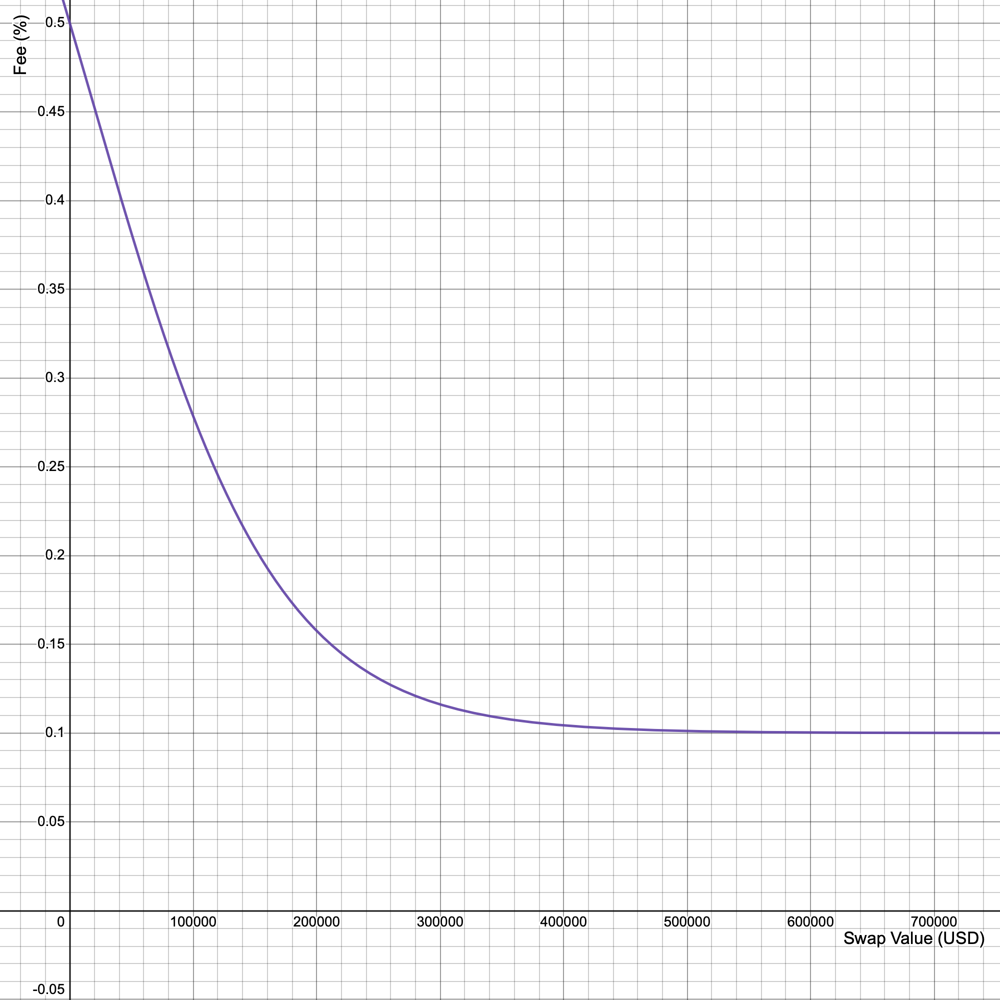
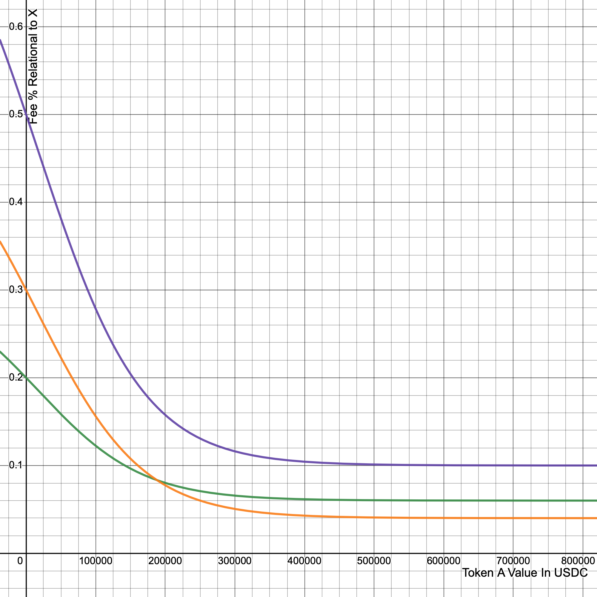

# Fee Structure

## Base Fee Motivation/Overview
The base user fee for autonomous trade execution by the beacon network is a dynamic price curve ranging from 0.5%-0.1% of the user's total transaction size. This fee is used to compensate the beacon for the execution of the transaction on the user's behalf. The base free shrinks at a proportional rate to the size of the transaction meaning smaller transactions will be closer to 0.5% while large transactions will dynamically approach 0.1%. This fee is chosen to facilitate a fair and thriving ecosystem that is overall beneficial to our userbase and the beacon network as a whole.  

The base fee is used to compensate the beacon for executing the transactions on the user's behalf. The fee is modeled after a modified logistic function. Formally our fee structure is based on the calculation below:

$$
f(x)=(.9/(1.25+e^{\left(\frac{x}{75000}\right)}))+0.1
$$

 

​This function is mathematically capped at a .5% base fee, which dynamically decreases down to a minimum of 0.1%. The benefits of a constant function allow for higher gas optimizations by reducing conditionals in the contract by means of a stepper system. Fees are calculated by the post-swap value, rather than the pre-swap value. This is to account for possible tokenomic tax many DeFi tokens implement. A visual representation of the above formula can be seen below:

Additional benefits of the above curve compared to a direct line of decreasing fees are threefold:

1. To maximize revenue for further development of current and future Conveyor protocols
2. Provide an immediate incentive for users to transact higher valued trades for reduced fees
3. Maintain a scalable, fair fee structure for institutional traders with higher USD value trades 

Examples of trade fees proportional to trade value can be seen below:

Column x references the USD value of the trade for each transaction while the f(x) column references the trade % in relation to its respective trade value.

The third column is a calculation of trade value * fee % to indicate the USD fee value associated with that trade 

### Examples
>A $1000 trade will have a 0.49% fee = ~$5  
>A $100,000 trade will have a 0.27% fee = ~$278  
>A $500,000 trade will have a 0.10% fee = ~$506  

## Beacon Reward
A subtle, but integral aspect of our fee structure that was chosen with regards to overall protocol security is the beacon reward. The beacon reward is critically important when considering the possibility of flash loan attacks on the liquidity pools through which the beacon will be executing the transactions. Since the beacon will have visibility over the pending transactions in the queue and know the execution prices of these transactions, it is important to have a mechanistic way of protecting our user base from bad actors in the beacon network. We want to ensure a fair beacon reward for execution while concurrently guaranteeing our user's protection from the possibility of beacons executing profitable flash loan attacks on liquidity pools to manipulate the spot price to reap the rewards of execution. 
The beacon reward regarding the fee has been rigorously determined based on principles of conservation functions used in the liquidity pools our users will be interacting with. In order to determine the optimal beacon reward we formulated objective models on the price impact in liquidity pools based on transaction size, formally we determined the relationship between large swap transactions in correspondence with reserve size to determine a formal model of the potential exploitability of the Conveyor Contract from bad actor beacons on our user base. 
By analytically determining the relationship between swap size and price impact based on reserve size in the liquidity pools we are able to in real-time calculate the exact threshold amount that a beacon could receive in one execution reward that would make such an attack profitable on the basis of price manipulation in the liquidity pool. We ensure to our user base the unprofitability of such attacks by putting a hard cap on the beacon reward that can be received in one execution to facilitate an ecosystem that rewards playing by the rules. 

## Beacon Reward vs. Conveyor Fee

A user will always pay a fee based on the logistic curve above for each transaction completed. The fee a user pays is split between Conveyor Labs and the Beacon, and is broken down into a sub curve to know exactly which values should be paid to each party.

For lower value TX's that have a higher-tiered fee ($100 trade for example), the ~0.5% fee is split `70% Conveyor Labs/ 30% Beacon`

For higher value TX's that have a lower-tiered fee ($500,000 trade for example), the ~0.1% fee is split `30% Conveyor Labs/ 70% Beacon`

This fee structure is ideal in that It's not only gas efficient, but lower value TX's offers Conveyor Labs a higher revenue stream while larger transactions offer larger rewards to the Beacon. This higher fee paid to the Beacon at higher values offers an increased financial incentive that strengthens the Beacon network and entices others to spin up a Beacon themselves for a chance of receiving a large reward.

The Below graph illustrates the % of the user fee split between the Beacon operator who successfully confirms the transaction, and the Conveyor Labs fee

The above graph implements the following fee calculation reserved for Conveyor Labs - Orange

$$
f(x)=(.585/(1.25+e^{\left(x/75000\right)}))\ +\ .04
$$

and the fee structure reserved for the Beacon that successfully executed the transaction - Green

$$
f(x)=(.315/(1.25+e^{\left(x/75000\right)}))\ +.06
$$

When both the orange and green logistic curves are combined, they result in the purple line, which is the total fee the user pays once their order is executed.
The benefit of implementing a crossover in reward allocation is that Beacons who confirm higher value transactions receive a higher proportion of the fee, while lower transactions benefit Conveyor Labs for future developments of the ecosystem. Custom beacon applications can be custom developed by software developers that only focus on higher-value transactions, while other Beacon applications can be focused on smaller, more frequent trades.
The end result is a fee structure where lower volume trades benefit the growth of Conveyor Labs -- and in turn its ecosystem -- while higher volume trades benefit the growth of the Beacon network responsible for automating the Conveyor ecosystem. 

The Desmos graph that plots the above functions and graphs can be seen via this [Desmos link](https://www.desmos.com/calculator/rwzozaktoc).