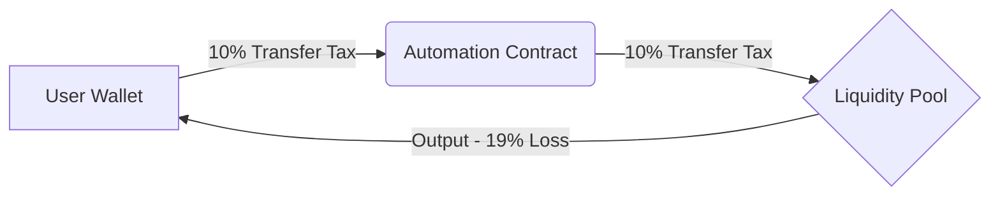
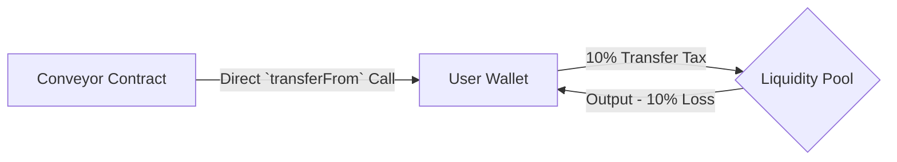

# 100% Non-Custodial

There are a few protocols on the market that provide automation for your tokens, but of those, many require you to send your assets to a shared contract in order to automate your trades. 

Due to these design decisions, tokens that implement a tax on transfer events *(tokenomics)* are discouraged from using these services. The primary reasons are twofold

1. Double-tax events
2. Likelyhood of lost funds

## Double-Tax Events

Due to the requirement for a user to send their tokens to a shared contract, they impose a first transfer tax event on sending thier assets to the shared contract in order to automate their future swap.

Those tokens are taxed a second time when the order is executed.

### Custodial Automation Providers 
!!!danger Custodial Automation Providers
A User wants to automate token *A* totaling 100 tokens. Token *A* has a 10% tax on transfer events. When the user transfers 100 Tokens to the Automation Contract, the Automation contract receives 10% less `100 tokens - 10% = 90 tokens`

When the trade conditions have been satisfied, an external caller calls the Automation contract to swap the remaining 90 tokens to the Liquidity pool, incurring another 10% transfer tax.

The resulting value is a swap of `90 tokens - 10% = 81 tokens` swapped for the output token
!!!

With Conveyor Finance, the automated swap starts and ends with the users wallet. This means that the only transfer tax event is when the users wallet interacts directly with the LP

!!!Success Conveyor's Non-Custodial Automation
A User wants to automate token *A* totaling 100 tokens. Token *A* has a 10% tax on transfer events.

When the trade conditions have been satisfied, an external caller calls the the Conveyor contract to do a `transferFrom` the users wallet to swap 100 tokens to the Liquidity pool, incurring a single 10% transfer tax event.

The resulting value is a swap of `100 tokens - 10% = 90 tokens` swapped for the output token
!!!

